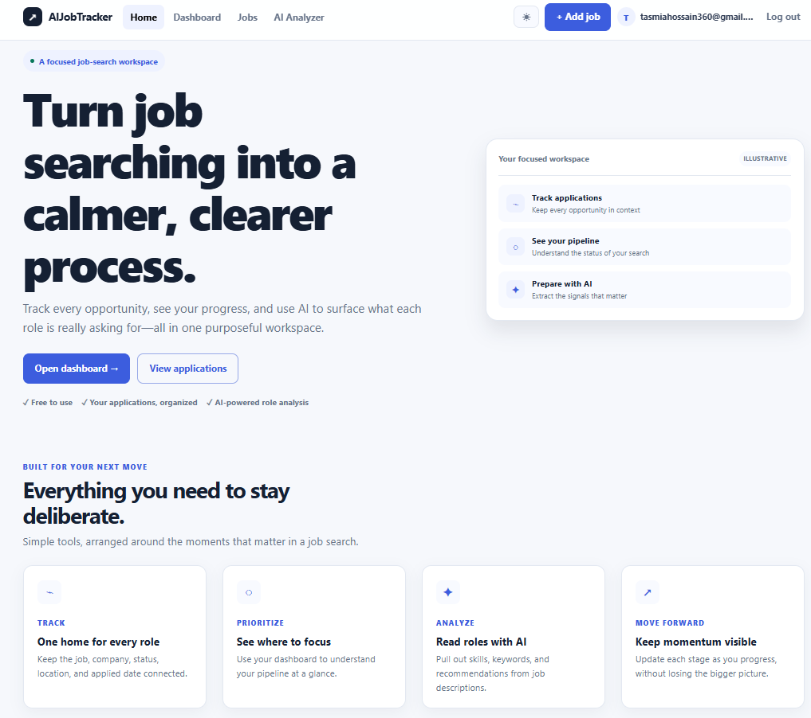
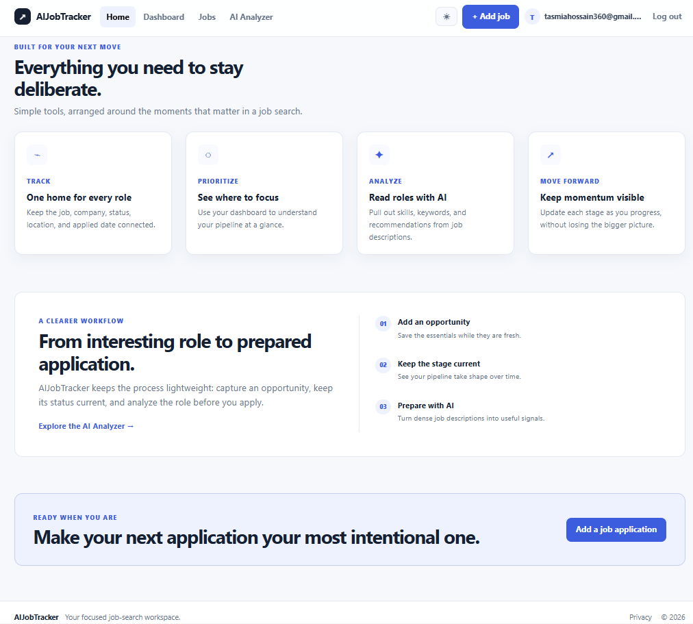
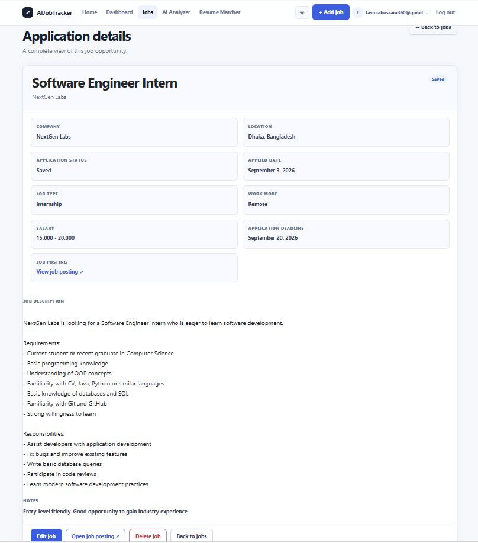
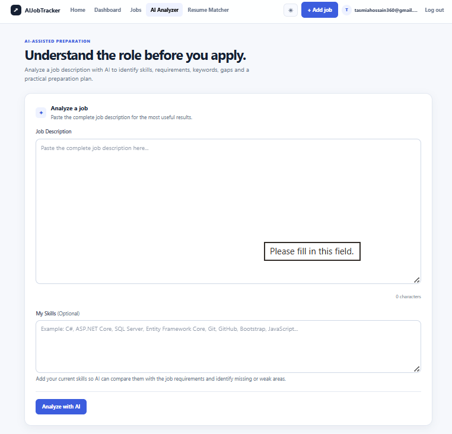
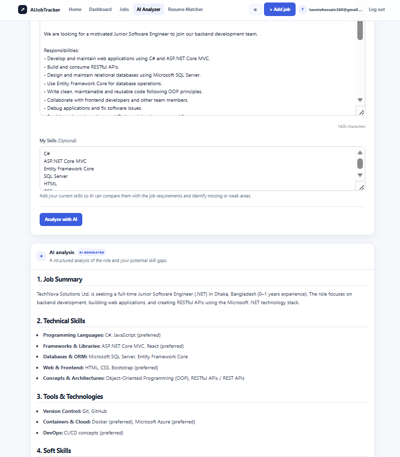
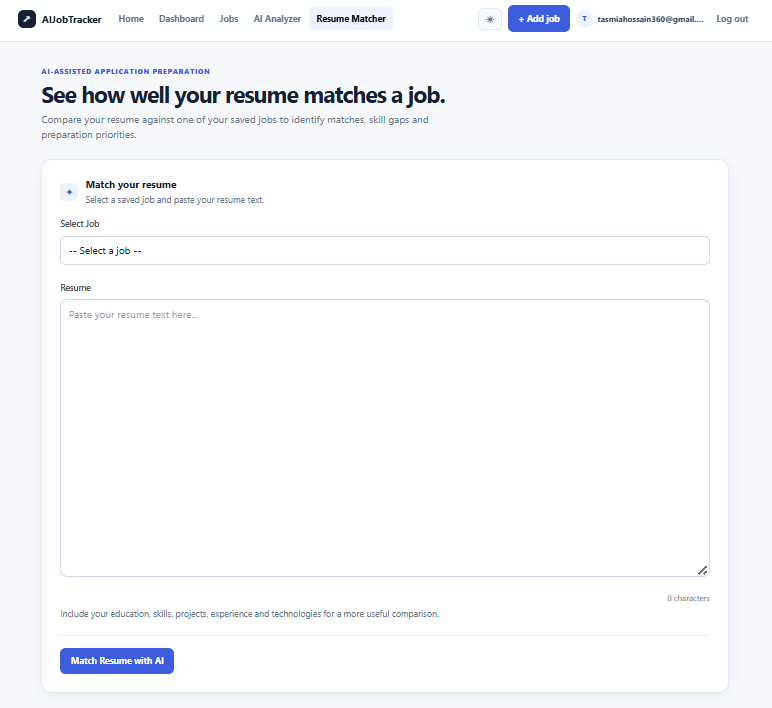
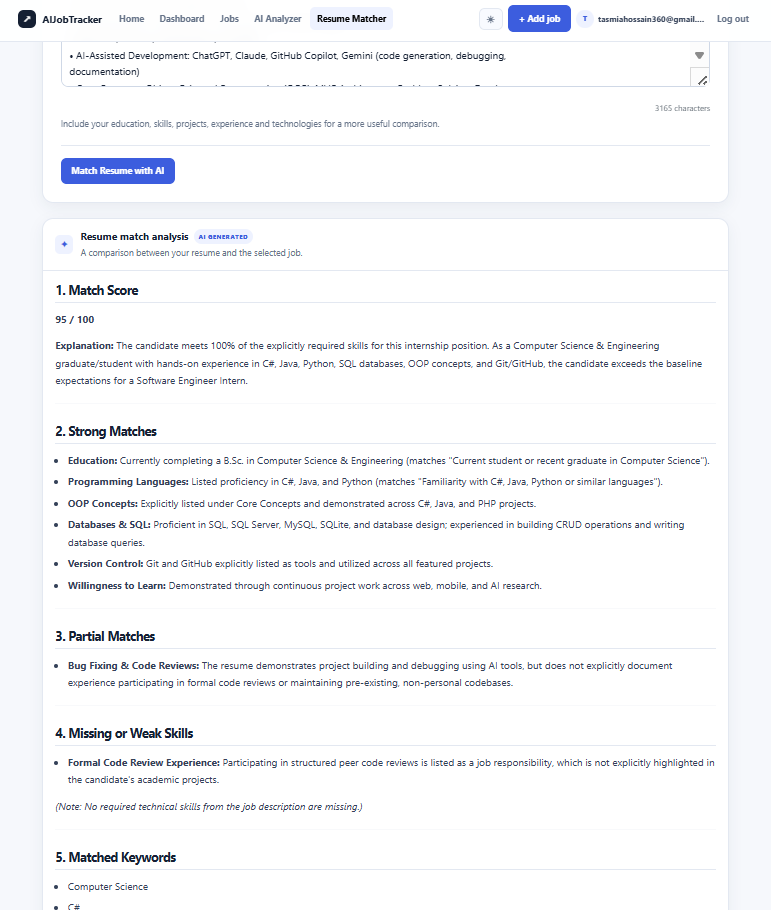

# AIJobTracker

<p align="center">
  
  
  
  
  
  
</p>

> **A focused job-search workspace for organizing applications, tracking progress, analyzing job descriptions with AI, and matching resumes to job opportunities.**

AIJobTracker is a full-stack **ASP.NET Core MVC** web application that helps job seekers manage their entire application pipeline from one place.

Users can securely create an account, manage job applications, search and filter opportunities, track application status history, monitor progress through an analytics dashboard, analyze job descriptions with AI, and compare their resume against saved job opportunities.

---

## Table of Contents

- [Highlights](#highlights)
- [Screenshots](#screenshots)
- [Features](#features)
- [Tech Stack](#tech-stack)
- [Architecture & Project Structure](#architecture--project-structure)
- [Application Workflow](#application-workflow)
- [Database](#database)
- [CRUD Operations](#crud-operations)
- [Validation & Security](#validation--security)
- [Getting Started](#getting-started)
- [Build & Verification](#build--verification)
- [Learning Goals](#learning-goals)
- [Future Improvements](#future-improvements)
- [Project Status](#project-status)
- [Author](#author)
- [License](#license)

---

## Highlights

- **Secure authentication** with ASP.NET Core Identity
- **User-specific data isolation** for job applications
- **Complete CRUD workflow** for job applications
- **Advanced search, filtering, and sorting**
- **Dashboard analytics** with application statistics and monthly activity
- **Detailed job information**, including salary, job type, work mode, deadline, URL, notes, and description
- **Application status history and timeline**
- **AI Job Analyzer** powered by Google Gemini
- **AI resume-to-job matching**, with match score, skill gaps, matched keywords, and recommendations
- **Markdown-formatted AI reports** rendered using Markdig
- **Responsive light and dark theme**
- **Server-side and client-side validation**
- **Responsive SaaS-style user interface**
- **SQL Server and Entity Framework Core** persistence

---

## Screenshots

### Home

The landing page introduces AIJobTracker and explains its core workflow and benefits.

<p align="center">
  
  
</p>

### Authentication

Users can create an account and securely sign in before accessing their personal job-tracking workspace.

<p align="center">
  
  
</p>

### Dashboard

The dashboard provides a centralized overview of the user's job application pipeline, including application statistics, rates, recent applications, upcoming deadlines, and monthly activity.

<p align="center">
  
</p>

### Job Applications

The applications page provides search, filtering, sorting, and quick access to saved job opportunities.

<p align="center">
  
</p>

### Add Job Application

Users can record detailed information about a job opportunity, including salary, job type, work mode, deadline, job description, URL, and personal notes.

<p align="center">
  
</p>

### Job Details

Each application has a dedicated details page containing job information and application status history.

<p align="center">
  
</p>

### AI Job Analyzer

The AI Job Analyzer accepts a job description and, optionally, the user's current skills, then generates a structured analysis using Google Gemini.

<p align="center">
  
</p>

### AI Analysis

The analyzer generates a structured AI-powered report covering job requirements, skills, keywords, skill matching, preparation, and application recommendations.

<p align="center">
  
</p>

### Resume Matcher

Users can enter their resume text and select one of their saved job applications for AI-powered resume-to-job matching.

<p align="center">
  
</p>

### Resume Match Analysis

The AI compares the resume with the selected job description and provides a match score, strong matches, partial matches, missing or weak skills, matched keywords, skill gaps, preparation suggestions, and an application recommendation.

<p align="center">
  
</p>

---

## Features

### Authentication & Authorization

AIJobTracker uses **ASP.NET Core Identity** to provide secure user authentication and authorization.

The application supports:

- User registration
- User login
- Secure logout
- Protected application-management pages
- User-specific job data
- User-specific dashboard statistics
- Anti-forgery protection for POST requests

Each user's job applications are isolated from other users.

### Job Application Management

Users can:

- Add new job applications
- View application details
- Edit application information
- Delete applications with confirmation
- Track the current application status
- Store job descriptions
- Store application notes

Each job application can contain:

- Job title
- Company
- Location
- Application status
- Applied date
- Job URL
- Minimum and maximum salary
- Job type
- Work mode
- Application deadline
- Job description
- Personal notes

### Application Status History

AIJobTracker maintains a history of status changes for each application.

Supported statuses include:

- **Saved**
- **Applied**
- **Interview**
- **Offer**
- **Rejected**
- **Withdrawn**

The application records status transitions and displays them as a timeline on the job details page.

For example:

```text
Created → Saved → Applied → Interview → Offer
```

This makes it easier to understand how each application has progressed over time.

### Advanced Search, Filtering & Sorting

The job applications page provides a comprehensive search, filtering, and sorting system.

| Capability | Options |
|---|---|
| Search by | Job title, company, location |
| Filter by | Application status, job type, work mode, salary range, applied date range, deadline status |
| Deadline filter | Upcoming, overdue, no deadline |
| Sort by | Job title, company, applied date, deadline, highest salary, lowest salary |

Search, filtering, and sorting options can be combined to quickly find specific opportunities.

### Dashboard & Analytics

The dashboard provides an overview of the authenticated user's job application pipeline, including:

- Total, saved, applied, interview, offer, rejected, and withdrawn applications
- Application rate, interview rate, and offer rate
- Recent applications
- Upcoming deadlines
- Monthly application activity

All dashboard statistics are calculated from the current user's own applications.

### AI Job Analyzer

The AI Job Analyzer uses **Google Gemini** to analyze job descriptions and generate a structured report covering:

1. Job summary
2. Technical skills
3. Tools & technologies
4. Soft skills
5. Education & qualifications
6. Experience requirements
7. Key responsibilities
8. Must-have skills
9. Nice-to-have skills
10. Important keywords
11. Skill match
12. Preparation plan
13. Application recommendation

The analyzer can also accept the user's current skills to provide a more candidate-focused skill match.

AI-generated Markdown content is converted into formatted HTML using **Markdig**.

### AI Resume-to-Job Matching

The Resume Matcher lets users compare their resume with a saved job opportunity.

The user provides:

- Resume text
- A saved job application containing a job description

The AI evaluates the resume against the job description and returns:

- **Match score**
- Strong matches
- Partial matches
- Missing or weak skills
- Matched keywords
- Skill gaps
- Preparation suggestions
- Application recommendation

The matching process focuses on evidence explicitly present in the resume and requirements explicitly present in the job description.

---

## Tech Stack

| Category | Technology |
|---|---|
| Language | C# |
| Framework | ASP.NET Core MVC |
| Runtime | .NET 10 |
| Authentication | ASP.NET Core Identity |
| ORM | Entity Framework Core |
| Database | SQL Server |
| Data Access | Entity Framework Core, Code First |
| Views | Razor Views |
| Frontend | HTML, CSS, JavaScript, Bootstrap |
| AI | Google Gemini |
| Markdown Rendering | Markdig |
| Version Control | Git & GitHub |

---

## Architecture & Project Structure

The project follows the **ASP.NET Core MVC** architecture with separate controllers, models, view models, data access, services, and Razor views.

```text
AIJobTracker/
├── Controllers/
│   ├── AccountController.cs
│   ├── AIController.cs
│   ├── DashboardController.cs
│   ├── HomeController.cs
│   ├── JobsController.cs
│   └── ResumeController.cs
│
├── Data/
│   └── ApplicationDbContext.cs
│
├── Migrations/
│
├── Models/
│   ├── ApplicationUser.cs
│   ├── DashboardViewModel.cs
│   ├── Job.cs
│   └── JobStatusHistory.cs
│
├── Services/
│   └── GeminiService.cs
│
├── ViewModels/
│   └── ResumeMatchViewModel.cs
│
├── Views/
│   ├── Account/
│   ├── AI/
│   ├── Dashboard/
│   ├── Home/
│   ├── Jobs/
│   ├── Resume/
│   └── Shared/
│
├── wwwroot/
│   ├── css/
│   └── js/
│
├── Program.cs
├── appsettings.json
└── AIJobTracker.csproj
```

---

## Application Workflow

```text
Register → Login → Dashboard → Add Job Application → Store Job Details
   → Track Application Status → Search / Filter / Sort → View Application Details
   → Track Status History → Analyze Job Description with AI → Match Resume with Job
   → Identify Skill Gaps → Prepare for the Opportunity
```

---

## Database

AIJobTracker uses **SQL Server** with **Entity Framework Core** following a **Code First** approach.

### Main Entities

| Entity | Description |
|---|---|
| `ApplicationUser` | Represents an authenticated application user |
| `Job` | Represents an individual job application and stores company, status, salary, deadline, job description, and notes |
| `JobStatusHistory` | Stores application status transitions and their timestamps |

### Relationships

```text
ApplicationUser (1) ──── (*) Job (1) ──── (*) JobStatusHistory
```

Each `Job` belongs to one authenticated user, and each `Job` can have multiple status-history records.

Entity Framework Core migrations are used to manage database schema changes.

---

## CRUD Operations

| Operation | Description |
|---|---|
| Create | Add a new job application |
| Read | View personal applications and application details |
| Update | Edit existing application information |
| Delete | Remove an application with confirmation |

---

## Validation & Security

The application includes several validation and security mechanisms:

- ASP.NET Core Identity authentication
- Authorization for protected routes
- User-specific data access
- Model validation using C# Data Annotations
- Required-field, string length, URL, and salary range validation
- Server-side and client-side validation
- Anti-forgery validation on POST operations
- Separation of application data by authenticated user

### Security Note

API keys, database credentials, and other sensitive information should never be committed to source control.

For local development, sensitive configuration should be stored securely using mechanisms such as **User Secrets** or environment variables.

---

## Getting Started

### Prerequisites

Make sure the following are installed:

- [.NET 10 SDK](https://dotnet.microsoft.com/download)
- Visual Studio 2022 or later, or another compatible .NET IDE
- SQL Server or SQL Server LocalDB
- Git
- Entity Framework Core CLI tools

If the Entity Framework Core CLI tools are not installed:

```bash
dotnet tool install --global dotnet-ef
```

### 1. Clone the Repository

```bash
git clone https://github.com/Tasmia-Hossain/AIJobTracker.git
```

### 2. Navigate to the Project

```bash
cd AIJobTracker
```

### 3. Restore Dependencies

```bash
dotnet restore
```

### 4. Configure the Database

Configure the SQL Server or SQL Server LocalDB connection string in your local development configuration.

Do not commit database credentials or other sensitive information to GitHub.

### 5. Configure the Gemini API

Configure the required Google Gemini API credentials using a secure local configuration mechanism such as User Secrets or environment variables.

Do not commit API keys to the repository.

### 6. Apply Entity Framework Migrations

```bash
dotnet ef database update
```

### 7. Run the Application

```bash
dotnet run
```

Then open the local URL displayed in the terminal.

---

## Build & Verification

```bash
dotnet build
```

The project builds successfully with **0 errors**.

---

## Learning Goals

This project was developed as a practical learning and portfolio project to strengthen skills in:

- C#
- ASP.NET Core MVC
- ASP.NET Core Identity
- Entity Framework Core
- SQL Server
- MVC architecture
- CRUD application development
- Authentication and authorization
- User-specific data handling
- Model binding
- Data validation
- Razor Views
- Bootstrap
- JavaScript
- Git and GitHub
- AI API integration
- Prompt engineering
- Markdown rendering
- AI-powered resume matching
- Application analytics

---

## Future Improvements

Potential future improvements include:

- Password reset and email verification
- Interview scheduling
- Application reminders and notifications
- Resume and document file attachments
- Pagination for large application lists
- REST API
- Company information and research
- Interview preparation assistant
- AI-powered job recommendations
- Cloud deployment
- Production-ready deployment configuration

---

## Project Status

**Status: Portfolio-ready**

AIJobTracker currently provides a complete job application management workflow with authentication, CRUD operations, advanced search and filtering, status history, dashboard analytics, AI job analysis, and AI-powered resume matching.

---

## Author

**Tasmia Hossain**

Computer Science & Engineering

GitHub: [Tasmia-Hossain](https://github.com/Tasmia-Hossain)

---

## License

This project was created for **learning and portfolio purposes**.