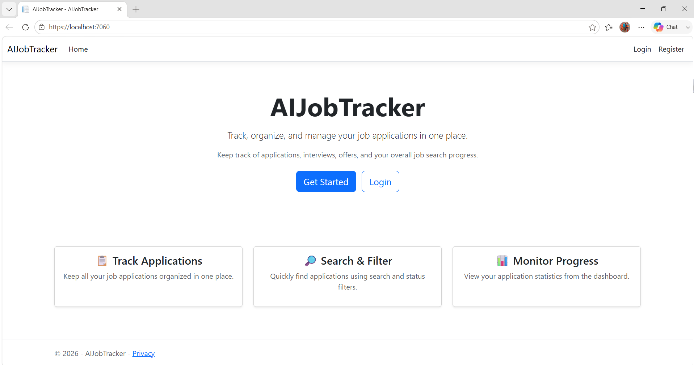
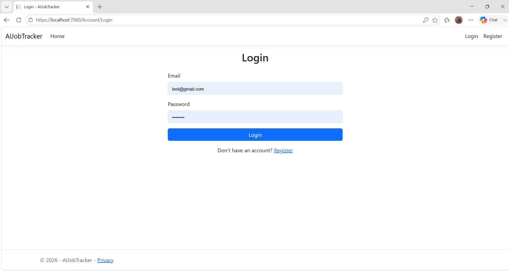
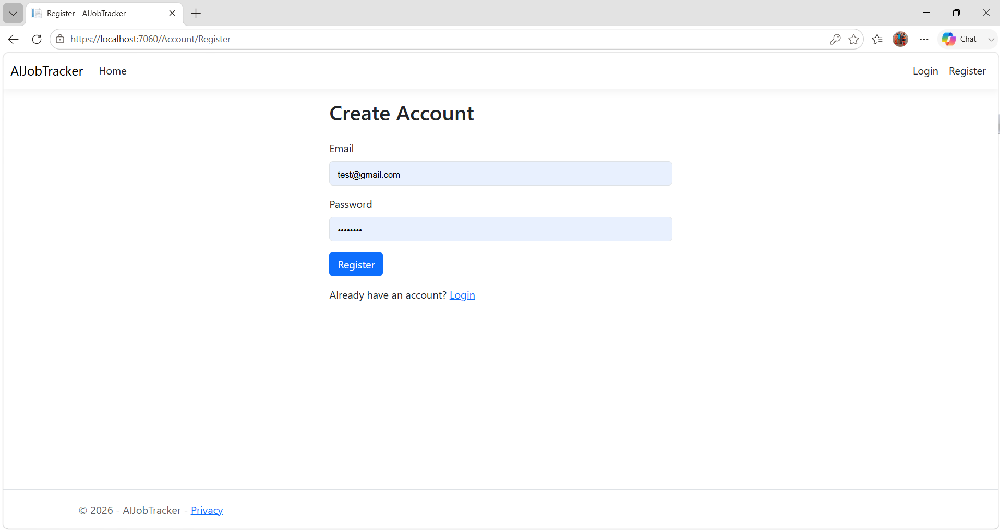
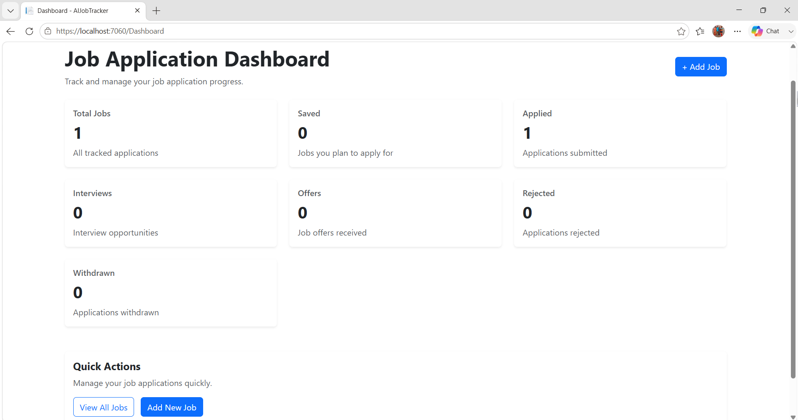
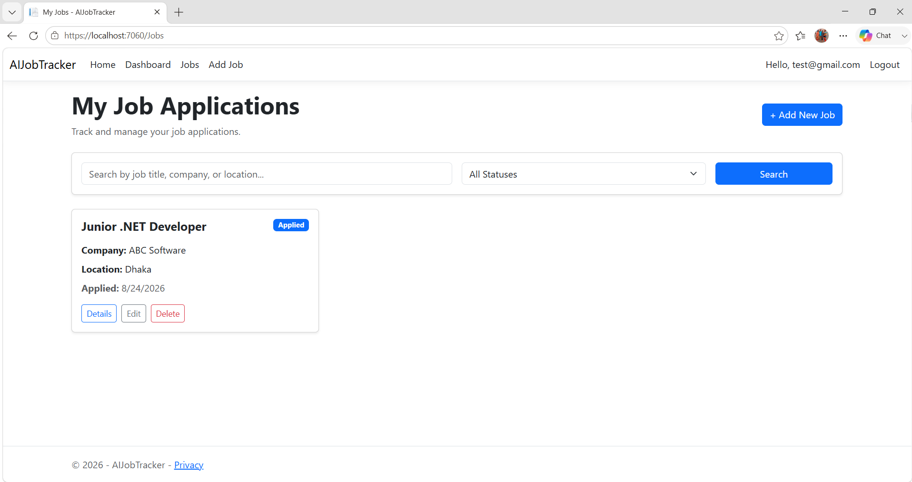
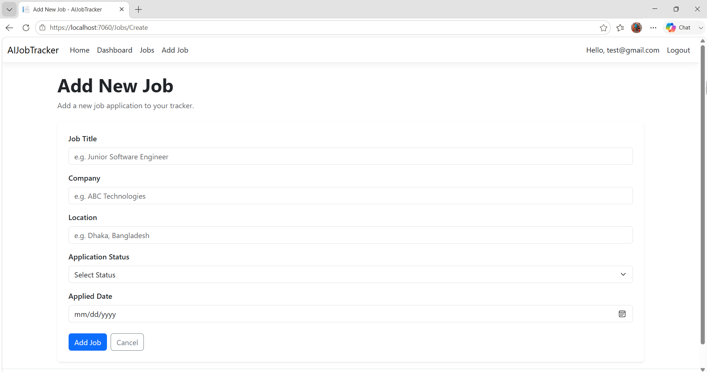

# AIJobTracker

AIJobTracker is a web-based job application tracking system built with ASP.NET Core MVC.

It helps users organize, track, search, filter, and manage their job applications from a single dashboard.

## Features

- User registration and login
- User authentication and authorization
- User-specific job application tracking
- Add new job applications
- Edit job applications
- Delete job applications with confirmation
- View job application details
- Search job applications
- Filter applications by status
- Combined search and filtering
- Dashboard with application statistics
- Form validation
- SQL Server database integration
- Entity Framework Core
- Entity Framework Core migrations
- Responsive Bootstrap-based UI

## Tech Stack

- C#
- ASP.NET Core MVC
- ASP.NET Core Identity
- Entity Framework Core
- SQL Server
- Razor Views
- Bootstrap
- HTML
- CSS
- JavaScript
- Git & GitHub

## Project Structure

```text
AIJobTracker/
├── Controllers/
│   ├── AccountController.cs
│   ├── DashboardController.cs
│   ├── HomeController.cs
│   └── JobsController.cs
├── Data/
│   └── ApplicationDbContext.cs
├── Migrations/
├── Models/
│   ├── ApplicationUser.cs
│   ├── DashboardViewModel.cs
│   └── Job.cs
├── Views/
│   ├── Account/
│   ├── Dashboard/
│   ├── Home/
│   ├── Jobs/
│   └── Shared/
├── wwwroot/
├── Program.cs
├── appsettings.json
└── AIJobTracker.csproj
```

## Application Workflow

The application follows a user-specific CRUD-based workflow:

1. Register a new account
2. Log in to the application
3. Access the authenticated dashboard
4. Add a new job application
5. Store the application in the SQL Server database
6. View personal job applications
7. Search applications
8. Filter applications by status
9. View detailed information about an application
10. Edit application information
11. Delete an application with confirmation
12. Monitor application statistics through the dashboard
13. Log out securely

## Authentication & Authorization

The application uses ASP.NET Core Identity for user authentication.

Authenticated users can:

- Register an account
- Log in
- Log out
- Access protected pages
- Manage only their own job applications
- View only their own dashboard statistics

The application uses authorization to prevent unauthenticated users from accessing protected job tracking functionality.

## Job Application Information

Each job application contains:

- Job Title
- Company
- Location
- Application Status
- Applied Date
- Associated User

Supported application statuses:

- Saved
- Applied
- Interview
- Offer
- Rejected
- Withdrawn

## Database

The project uses:

- SQL Server
- Entity Framework Core
- Code First approach
- Entity Framework Core Migrations
- ASP.NET Core Identity

The `Job` model is mapped to the `Jobs` table in the database.

Each job application is associated with an authenticated user through the `ApplicationUser` relationship.

## CRUD Operations

| Operation | Description |
|---|---|
| Create | Add a new job application |
| Read | View personal applications and application details |
| Update | Edit existing application information |
| Delete | Remove an application with confirmation |

## Search & Filtering

The application provides:

- Job search functionality
- Search by job title
- Search by company
- Search by location
- Status-based filtering
- Combined search and filtering

These features allow users to quickly find specific job applications.

## Dashboard

The dashboard provides an overview of the authenticated user's job applications, including:

- Total Jobs
- Saved Jobs
- Applied Jobs
- Interview Jobs
- Offer Jobs
- Rejected Jobs
- Withdrawn Jobs

The dashboard statistics are calculated only from the current user's job applications.

## Validation

Form validation is implemented to ensure that required job information is provided before an application is submitted.

Required fields include:

- Job Title
- Company
- Application Status

Validation is handled using C# Data Annotations and ASP.NET Core MVC model validation.

## Screenshots

### Home Page



### Login



### Register



### Dashboard



### Job Applications



### Add New Job



## Getting Started

### Prerequisites

Make sure you have the following installed:

- .NET SDK
- Visual Studio
- SQL Server or SQL Server LocalDB
- Git

### Clone the Repository

```bash
git clone https://github.com/Tasmia-Hossain/AIJobTracker.git
```

### Navigate to the Project

```bash
cd AIJobTracker
```

### Restore Dependencies

```bash
dotnet restore
```

### Apply Database Migration

```bash
dotnet ef database update
```

### Run the Application

```bash
dotnet run
```

Then open the local URL shown by the application.

## Security Notes

- Authentication is implemented using ASP.NET Core Identity.
- Job applications are associated with authenticated users.
- Users can access only their own job applications.
- Authorization protects job tracking functionality.
- Anti-forgery validation is used for POST operations.
- Sensitive credentials and secrets should not be committed to the repository.

## Future Improvements

Possible future improvements include:

- Password reset functionality
- Email verification
- Job application notes
- Interview scheduling
- Job application reminders
- Resume attachment
- Job posting URL
- Salary information
- Company information
- Pagination
- Sorting
- Improved dashboard charts
- REST API
- AI-powered job recommendations
- AI-assisted application tracking
- Cloud deployment

## Learning Goals

This project was built as a practical learning project to strengthen skills in:

- C#
- ASP.NET Core MVC
- ASP.NET Core Identity
- Entity Framework Core
- SQL Server
- MVC architecture
- CRUD operations
- User authentication
- Authorization
- User-specific data handling
- Model binding
- Form validation
- Razor Views
- Bootstrap
- Git & GitHub

## Author

**Tasmia Hossain**

Computer Science & Engineering

GitHub: [Tasmia-Hossain](https://github.com/Tasmia-Hossain)

## License

This project is created for learning and portfolio purposes.